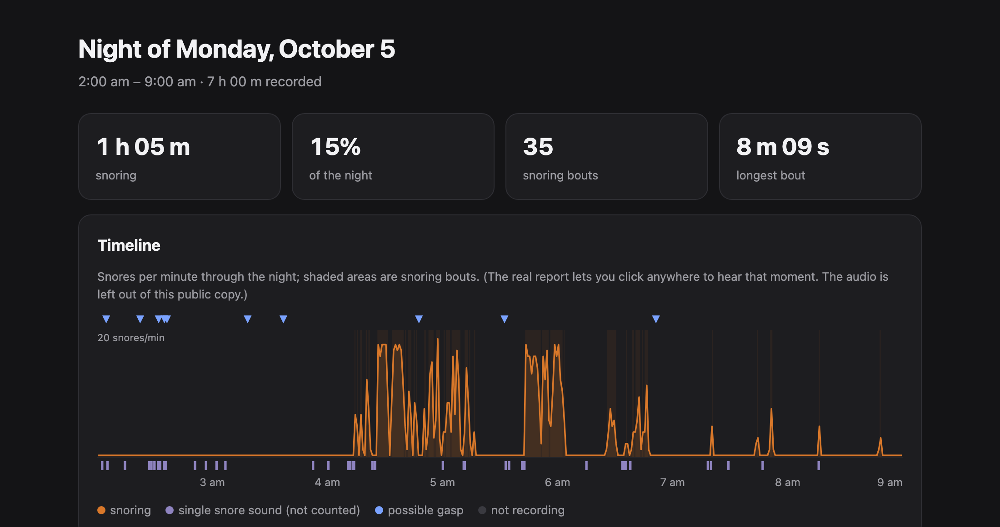
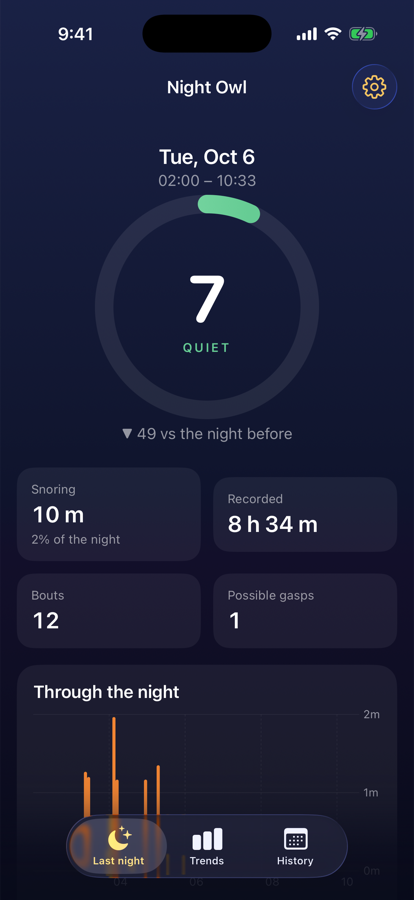
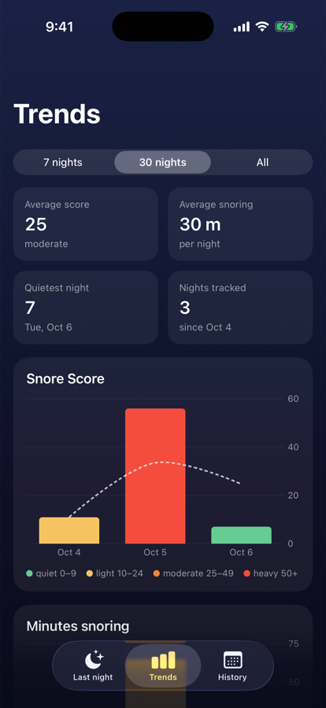
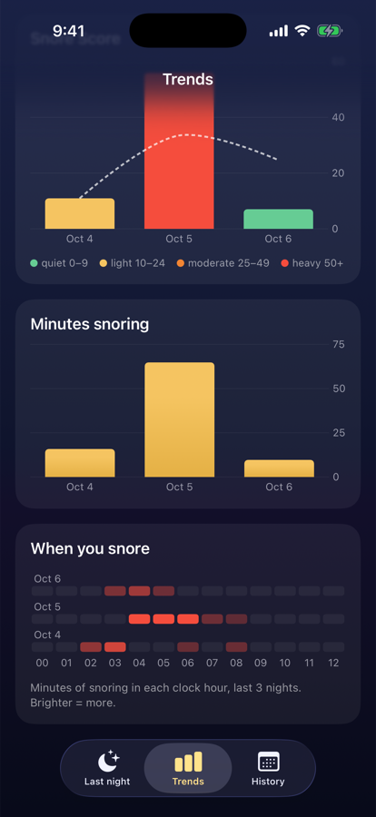

# Night Owl
Raspberry Pi with a USB mic next to my bed. records the whole nightruns it through YAMNet. generates a sleep chart that lets you listen to all snoring periods detected. aiming to integrate smart tracker metric side by side (whoop, fitbit, whatever works), to see blood oxygen, breathing rate etc. I think I could add an infrared camera, to watch my breathing and sleeping position in the dark.

real night minus audio

---

## iPhone app
every morning the Mac pulls the night off the Pi, scores it, drops the summary + snore clips in iCloud Drive and pings my phone. the app shows last night, trends across nights and when in the night I snore. tap any bout to hear it. not on the App Store, I just build it from Xcode (`ios/`, `xcodegen` then run).

  

**Snore Score** = 5 × minutes snoring per hour + 1 per possible gasp. lower is better. 0–9 quiet, 10–24 light, 25–49 moderate, 50+ heavy.
